# Bing Image AI Generator GUI
## Table of Contents

- [What is this program for?](#what-is-this-program-for)
- [Why use this software?](#why-use-this-software)
- [How does it look? (Screenshots)](#how-does-it-look-screenshots)
- [How does it work?](#how-does-it-work)
- [Steps to use](#steps-to-use)
- [How to Extract Cookies for Use (IMPORTANT)](#how-to-extract-cookies-for-use-important)
  - [Firefox and Firefox-based Browsers](#firefox-and-firefox-based-browsers)
  - [Chromium-based Browsers (Chrome, Edge, Opera, Vivaldi, Brave)](#chromium-based-browsers-chrome-edge-opera-vivaldi-brave)
- [Thanks To](#thanks-to)
- [Legal Notice](#legal-notice)
- [About](#about)
- [Donation](#donation)

## What is this program for? 

This TK Application is designed to automate the image generation process, similar to Midjourney. It enables the utilization of multiple accounts by leveraging their respective cookies. These cookies provide direct access to their services, eliminating the need for a web browser.

## Why use this software?

- **Enhanced Productivity:** Take control of your content generation
- **User-Friendly:** No coding skills required
- **Free Image Generation:** It's cost-effective; all you need is a Hotmail/Outlook account (or multiple accounts)

## How does it look? (Screenshots)

- The interface:

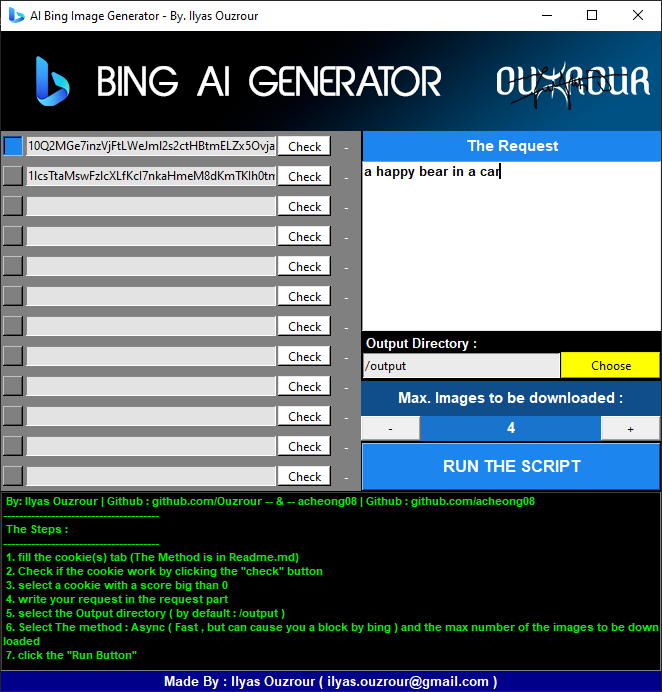

- A Successful Operation **(takes 5 seconds)**:

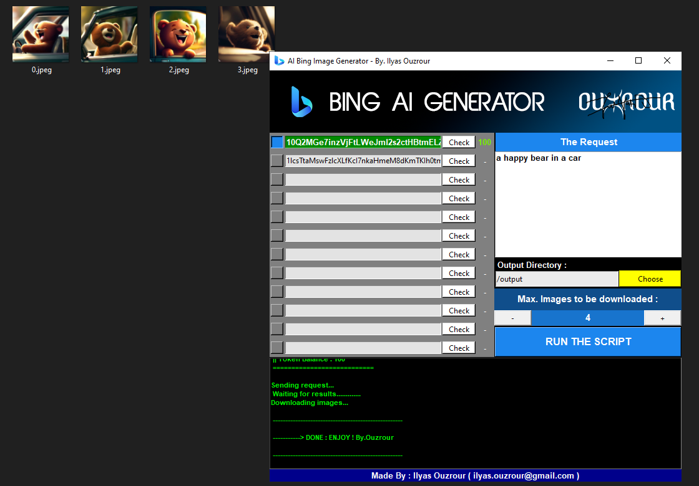

- A Failed Operation:

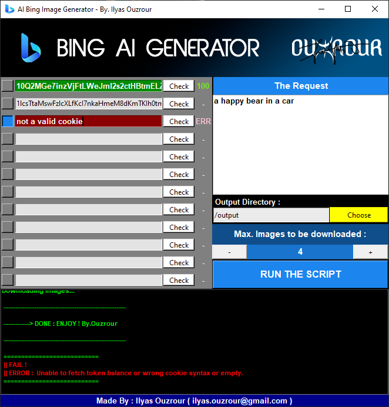

## How does it work?

1. Extract the Cookie value (See below)
2. Fill in the "Cookies" tab using two methods:
   1. **Method 1 (Short-Term):** Enter the cookie address in the respective row, as shown:
      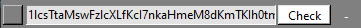
   2. **Method 2 (Permanent):** Open the **_.env_** file and input the cookie(s):
      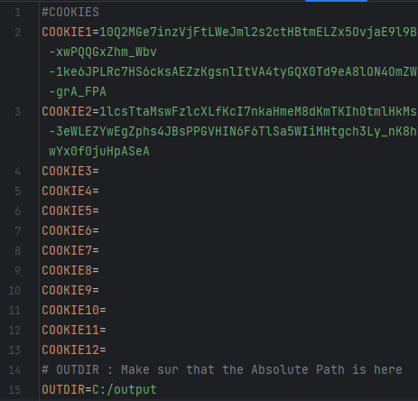. After that, launch the software (**_synchro.py_**).
3. Check if the cookie works by clicking the "**_check_**" button in the corresponding row:
   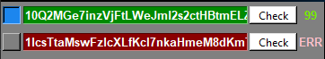
4. Select a row with a coin value > 0:
   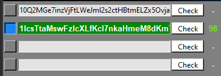
5. Write your request in the "Request" window. If you have no preferences, the output directory will default to "/output" or the value in the .env file. Click the "**_ENTER Button_**" after completing your request:
   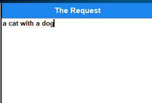
6. Choose the output directory by clicking "**_Choose_**" or manually entering the ABSOLUTE PATH (not the relative PATH). By default, the value of the constant **OUTDIR** in **_.env_** is used; otherwise, the value "**/output**" is assigned:
   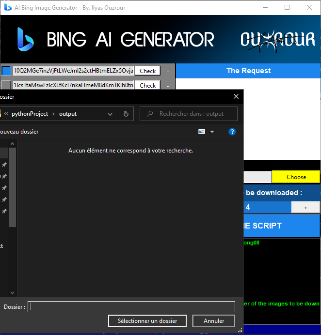
7. Select the **maximum** number of images to download **(1-4)**:
   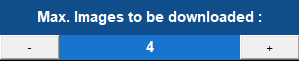
8. Click the "Run" button:
   

## Steps to use:

1. Install all dependencies by opening the Command Prompt in the same folder as this code. Only do this once; if you've done it before, proceed to Step 2:
   ```cmd
   pip install -r requirements.txt
   ```
2. Modify the .env file by entering the values you want to use permanently.
3. Run ai_generator.py.
4. Enjoy!

## How to Extract Cookies for Use (IMPORTANT)

### Firefox and Firefox-based Browsers:

1. Go to [Bing.com/create](https://bing.com/create).
2. Click on the "Join and Create" button ("**Rejoindre et créer**" in French):
   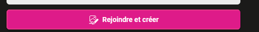
3. Log in to your Hotmail/Outlook account:
   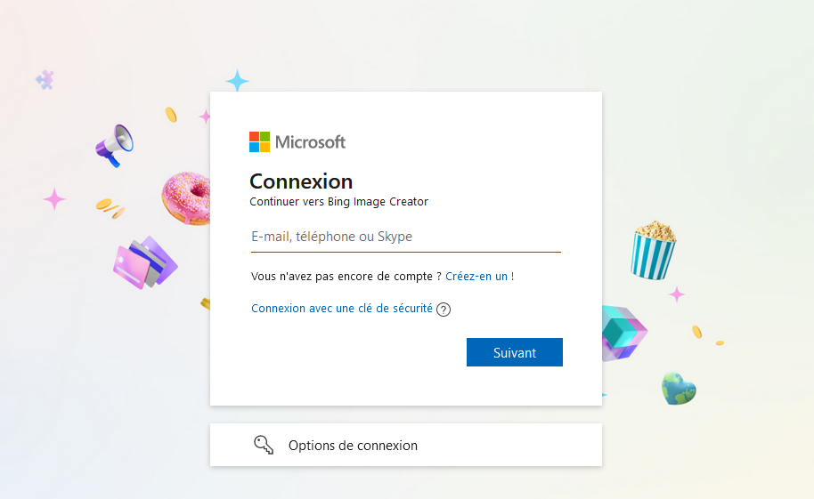
4. After logging in, you'll return to the bing.com/Create page. Press **F12** to open the Developer Console:
   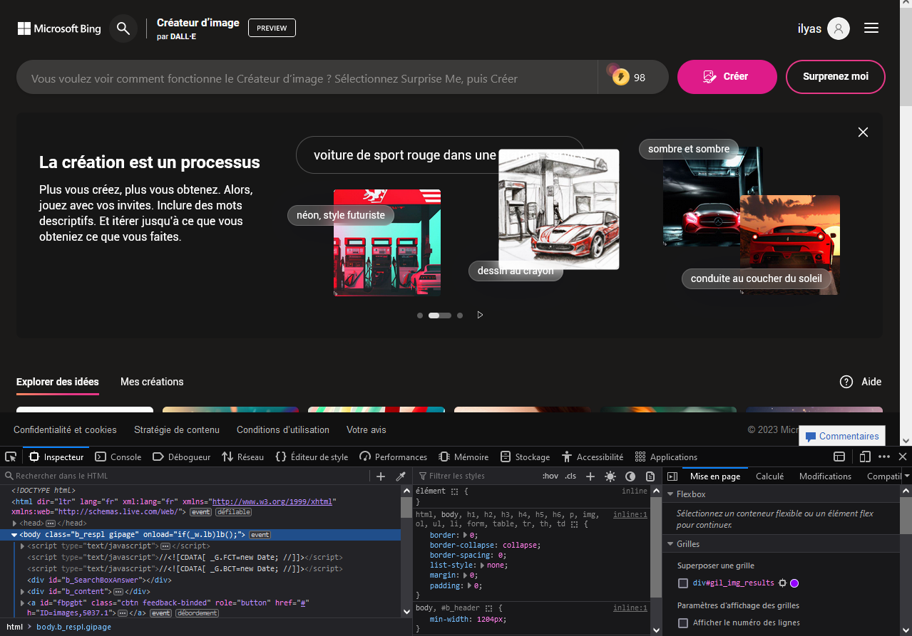
5. Navigate to the Storage tab ("Stockage" in French):
   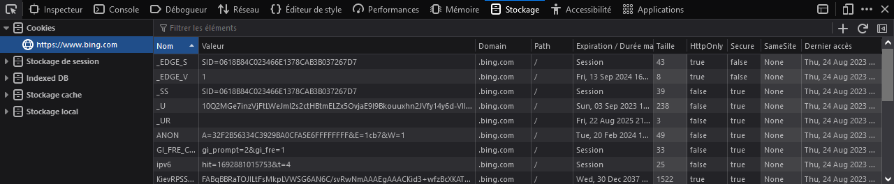
6. Select the value with "**_U**", then click the right mouse button and select "**Copy**":
   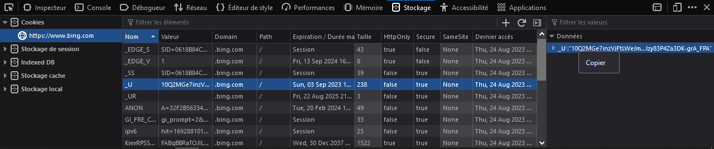
7. Paste it into the **.env** file to save these steps for later or directly into the software.

### Chromium-based Browsers (Chrome, Edge, Opera, Vivaldi, Brave):

1. Go to [Bing.com/create](https://bing.com/create).
2. Click on the "Join and Create" button ("**Rejoindre et créer**" in French):
   
3. Log in to your Hotmail/Outlook account:
   
4. After logging in, you'll return to the bing.com/Create page. Press **F12** to open the Developer Console:
   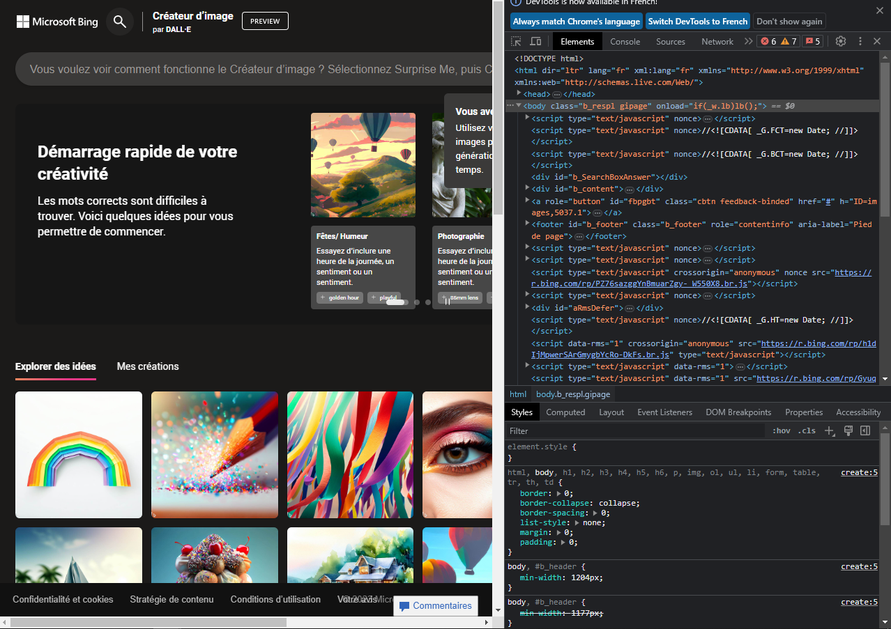
5. Navigate to the Console tab:
   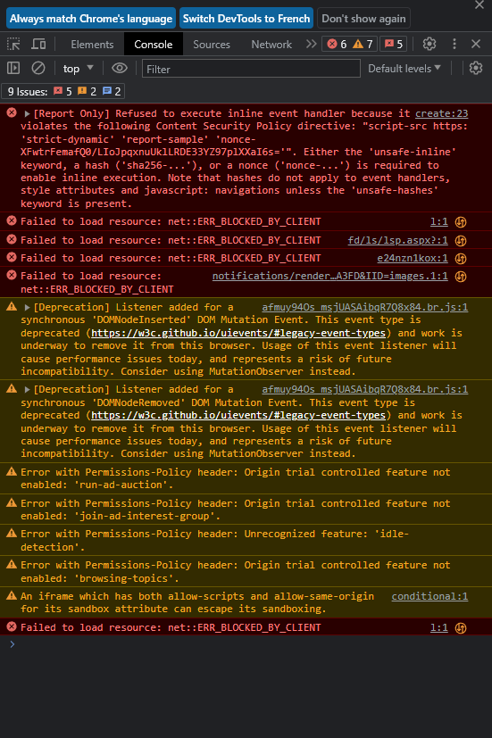
6. Enter the following code and press Enter:
   ```js
   cookieStore.get("_U").then(result => console.log(result.value))
   ```
   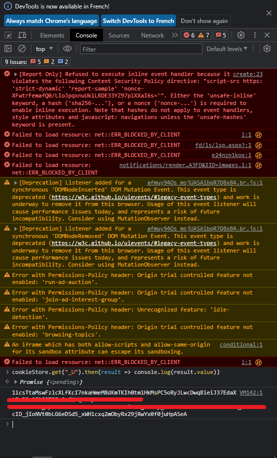
7. Copy the Cookie Address to the **.env** file to save these steps for later or directly into the software.

## Thanks To 
acheong08 : https://github.com/acheong08/BingImageCreator


## Legal Notice
**_Bing Image AI Generator_** is a product developed by **Ilyas Ouzrour**. It is designed to enhance image generation efficiency using Bing's services. This software is provided as-is, and the developers hold no responsibility for any misuse or improper use of the software. Usage of this software should adhere to Bing's terms of service and legal guidelines.

## About
**_Bing Image AI Generator_** is a project born out of the need to simplify and expedite the process of image generation. We believe in the power of automation and efficiency. Our team is dedicated to providing users with a reliable and user-friendly tool to meet their image generation needs.

## Donation 
Paypal : [Ouzrour](https://www.paypal.me/praxidike )
